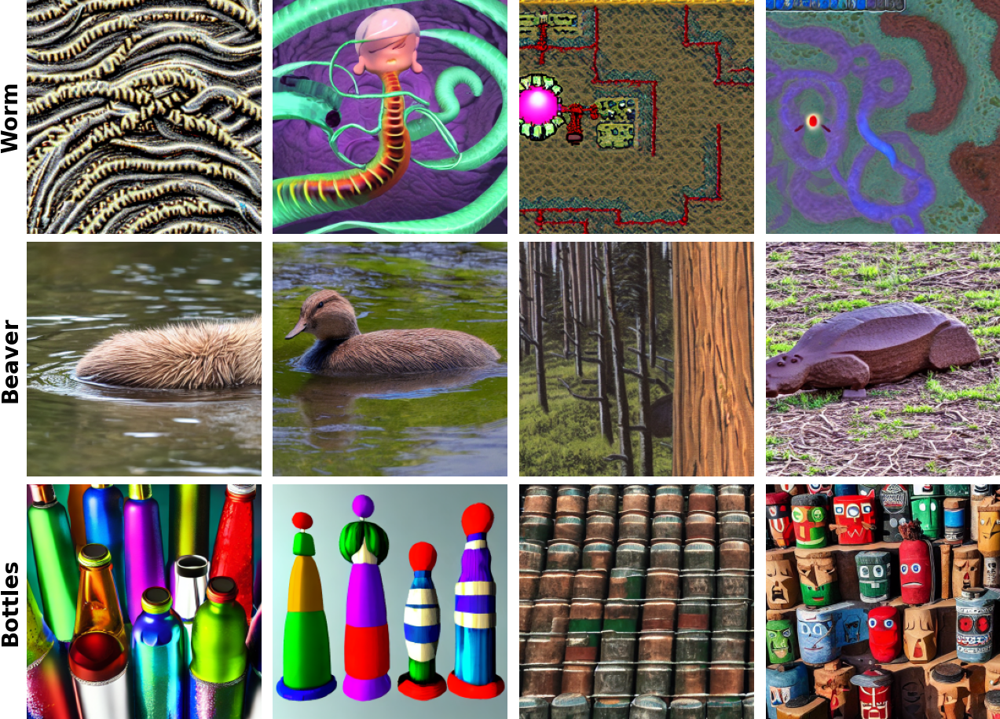

# Non-Linear Outlier Synthesis

Code used for our paper [Non-Linear Outlier Synthesis for Out-of-Distribution Detection](https://arxiv.org/pdf/2407.04022).



This repository contains the code to obtain diffusion embeddings, train our conditional volume-preserving networks, sample outlier embeddings, synthesize the outliers and train and test classifiers.

### Abstract

The reliability of supervised classifiers is severely hampered by their limitations in dealing with unexpected inputs, leading to great interest in out-of-distribution (OOD) detection. Recently, OOD detectors trained on synthetic outliers, especially those generated by large diffusion models, have shown promising results in defining robust OOD decision boundaries. Building on this progress, we present NCIS, which enhances the quality of synthetic outliers by operating directly in the diffusion's model embedding space rather than combining disjoint models as in previous work and by modeling class-conditional manifolds with a conditional volume-preserving network for more expressive characterization of the training distribution. We demonstrate that these improvements yield new state-of-the-art OOD detection results on standard ImageNet100 and CIFAR100 benchmarks, and provide insights into the importance of data pre-processing and other key design choices.

### Installation

We used the following conda environment:
```
conda env create -f environment.yml
```
Please follow the instructions [here](https://github.com/deeplearning-wisc/dream-ood/tree/main?tab=readme-ov-file#dataset-preparation) to download all datasets used in our work.

### Running NCIS
#### 1. Obtaining diffusion embeddings

The first step of NCIS is obtaining the embeddings in the diffusion conditioning space. To do so for the first 500 images of CIFAR100, use the following command:
```
python3 scripts/get_embeddings/embed_c100_images_clip.py --num_images 500 --offset 0
```

#### 2. Fitting class-wise non-linear manifolds with cVPN

The next step is to learn the manifold of each class with the conditional volume-preserving network, done with the command 
```
python3 nl-invs/train.py
```
Training parameters such as the dataset, learning rate, and number of epochs can be specified in [this](https://github.com/LarsDoorenbos/NCIS/blob/main/nl-invs/params.yml) file.

#### 3. Sampling OOD embeddings

To sample from OOD samples from the cVPN, use 
```
python3 nl-invs/evaluate.py
```
Again, parameters can be specified in [this](https://github.com/LarsDoorenbos/NCIS/blob/main/nl-invs/params.yml) file.

#### 4. Generating synthetic outliers

From the sampled OOD embeddings, you can generate outliers with
```
python3 scripts/dream_ood.py --plms \
--n_iter 400 --n_samples 8 \
--outdir generated_images_c100/ \
--loaded_embedding generated_samples_cifar100_1e-05.npy \
--ckpt sd-v1-4.ckpt \
--id_data c100 \
--skip_grid 
```
For this, you need Stable Diffusion 1.4, which can be downloaded [here](https://huggingface.co/CompVis/stable-diffusion-v-1-4-original/tree/main).

#### 5. Train the classifier with the generated outliers

Train the classifier with the generated outliers with
```
python3 scripts/train_ood_det_cifar100.py --my_info generated_images_c100
```

#### 6. Evaluate the trained model

The trained model can then be evaluated for its OOD detection with 
```
python3 scripts/test_ood_c100.py --load cifar100_wrn_s1_energy_ft_sd_slope_0_weight_1.0_epoch_249.pt
```
We provide pre-trained models for both datasets used in the paper at [this link](https://drive.google.com/drive/folders/1qjIvGUF5Jv9axvwXpRZeliWbyw751sn8?usp=sharing).

### Comments

Our codebase builds on the [Dream-OOD](https://github.com/deeplearning-wisc/dream-ood/tree/main) and [Non-linear invariants](https://github.com/LarsDoorenbos/Nonlinear-invariants) repositories.

### Citation

If you find this work helpful, consider citing it using

```
@article{doorenbos2024non,
  title={Non-Linear Outlier Synthesis for Out-of-Distribution Detection},
  author={Doorenbos, Lars and Sznitman, Raphael and M{\'a}rquez-Neila, Pablo},
  journal={arXiv preprint arXiv:2411.13619},
  year={2024}
}
```
